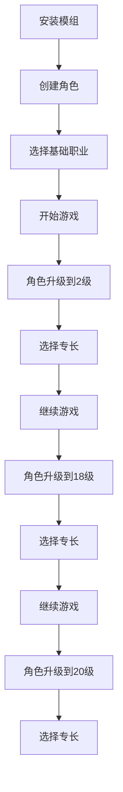

## 1. Product Overview

**ExtraFeatsForAllClasses** 是一个《博德之门3》模组，为所有12种基础主职业在2级、18级、20级各增加一个专长选择机会。
- 该模组旨在为玩家提供更多的角色定制选项，增强游戏的策略深度和角色构建的灵活性。
- 目标是在不破坏原有职业平衡的前提下，为所有职业提供额外的成长路径和专长选择。

## 2. Core Features

### 2.1 User Roles

本模组不需要区分用户角色，所有玩家均可使用。

### 2.2 Feature Module

我们的专长增强模组包含以下主要功能模块：

1. **职业进展配置页面**：为12种基础职业配置额外专长选择
2. **模组元数据页面**：定义模组基本信息和依赖关系
3. **本地化文件页面**：提供中英文界面支持

### 2.3 Page Details

| Page Name | Module Name | Feature description |
|-----------|-------------|---------------------|
| 职业进展配置页面 | 战士进展配置 | 为战士职业在2级、18级、20级添加AllowImprovement=true属性，启用专长选择 |
| 职业进展配置页面 | 法师进展配置 | 为法师职业在2级、18级、20级添加AllowImprovement=true属性，启用专长选择 |
| 职业进展配置页面 | 牧师进展配置 | 为牧师职业在2级、18级、20级添加AllowImprovement=true属性，启用专长选择 |
| 职业进展配置页面 | 盗贼进展配置 | 为盗贼职业在2级、18级、20级添加AllowImprovement=true属性，启用专长选择 |
| 职业进展配置页面 | 游侠进展配置 | 为游侠职业在2级、18级、20级添加AllowImprovement=true属性，启用专长选择 |
| 职业进展配置页面 | 圣武士进展配置 | 为圣武士职业在2级、18级、20级添加AllowImprovement=true属性，启用专长选择 |
| 职业进展配置页面 | 术士进展配置 | 为术士职业在2级、18级、20级添加AllowImprovement=true属性，启用专长选择 |
| 职业进展配置页面 | 邪术师进展配置 | 为邪术师职业在2级、18级、20级添加AllowImprovement=true属性，启用专长选择 |
| 职业进展配置页面 | 野蛮人进展配置 | 为野蛮人职业在2级、18级、20级添加AllowImprovement=true属性，启用专长选择 |
| 职业进展配置页面 | 吟游诗人进展配置 | 为吟游诗人职业在2级、18级、20级添加AllowImprovement=true属性，启用专长选择 |
| 职业进展配置页面 | 德鲁伊进展配置 | 为德鲁伊职业在2级、18级、20级添加AllowImprovement=true属性，启用专长选择 |
| 职业进展配置页面 | 武僧进展配置 | 为武僧职业在2级、18级、20级添加AllowImprovement=true属性，启用专长选择 |
| 模组元数据页面 | 模组信息配置 | 定义模组名称、版本、作者、描述等基本信息，设置模组UUID和依赖关系 |
| 本地化文件页面 | 中文本地化 | 提供模组名称、描述等文本的中文翻译 |
| 本地化文件页面 | 英文本地化 | 提供模组名称、描述等文本的英文翻译 |

## 3. Core Process

### 主要用户操作流程

1. **模组安装流程**：玩家下载并安装模组到BG3模组目录
2. **角色创建流程**：玩家创建角色时选择任意基础职业
3. **等级提升流程**：当角色达到2级、18级、20级时，系统自动提供专长选择界面
4. **专长选择流程**：玩家从可用专长列表中选择一个专长来增强角色能力

## 4. User Interface Design

### 4.1 Design Style

- **主要颜色**：沿用BG3原版UI配色方案，深棕色背景配金色边框
- **次要颜色**：使用暖色调的橙色和黄色作为强调色
- **按钮样式**：采用BG3原版的古典风格按钮，带有金属质感边框
- **字体**：使用游戏默认字体，中文支持宋体，英文使用Cinzel字体
- **布局样式**：采用卡片式布局，顶部导航栏设计
- **图标样式**：使用中世纪奇幻风格的图标，与游戏整体美术风格保持一致

### 4.2 Page Design Overview

| Page Name | Module Name | UI Elements |
|-----------|-------------|-------------|
| 职业进展配置页面 | 进展配置界面 | 使用XML配置文件格式，深色背景，金色文本高亮，清晰的层级结构显示 |
| 模组元数据页面 | 模组信息界面 | 简洁的信息展示卡片，包含模组图标、名称、版本号、作者信息等 |
| 本地化文件页面 | 文本配置界面 | 双列布局显示中英文对照，使用表格形式组织内容ID和对应文本 |

### 4.3 Responsiveness

本模组主要面向PC平台的《博德之门3》游戏，采用桌面优先的设计理念，无需考虑移动端适配。界面设计遵循游戏原有的UI规范和交互模式。