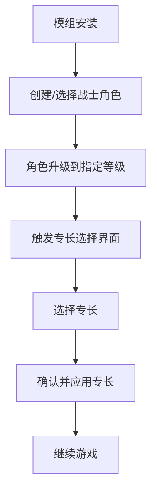

# FighterExtraFeats 模组需求文档

## 1. 产品概述

**FighterExtraFeats** 是一个专为《博德之门3》战士职业设计的增强模组，为战士主职业在特定等级提供额外的专长学习机会。

该模组旨在增强战士职业的多样性和定制化程度，让玩家能够在关键等级节点获得更多专长选择，从而创造更加个性化的战士角色构建，同时保持游戏的平衡性。

## 2. 核心功能

### 2.1 用户角色

本模组不涉及特殊用户角色区分，所有玩家均可使用。

### 2.2 功能模块

我们的FighterExtraFeats模组包含以下主要功能：

1. **专长增强系统**：在指定等级为战士提供额外专长选择
2. **等级进展配置**：修改战士职业的等级进展表
3. **本地化支持**：提供中英文界面文本

### 2.3 页面详情

| 功能模块 | 组件名称 | 功能描述 |
|----------|----------|----------|
| 专长增强系统 | 2级专长选择 | 在战士2级时提供一个额外的专长选择机会 |
| 专长增强系统 | 10级专长选择 | 在战士10级时提供一个额外的专长选择机会 |
| 专长增强系统 | 18级专长选择 | 在战士18级时提供一个额外的专长选择机会 |
| 专长增强系统 | 20级专长选择 | 在战士20级时提供一个额外的专长选择机会 |
| 等级进展配置 | Progressions.lsx | 配置战士职业在指定等级的AllowImprovement属性 |
| 本地化支持 | 中文本地化 | 提供模组名称、描述等中文文本 |
| 本地化支持 | 英文本地化 | 提供模组名称、描述等英文文本 |

## 3. 核心流程

### 主要用户操作流程

1. **模组安装**：玩家安装FighterExtraFeats模组
2. **角色创建**：创建战士职业角色或使用现有战士角色
3. **等级提升**：当战士达到2级、10级、18级或20级时
4. **专长选择**：系统自动提供专长选择界面
5. **专长确认**：玩家选择所需专长并确认

## 4. 用户界面设计

### 4.1 设计风格

- **主色调**：沿用游戏原生UI风格，深蓝色(#1e3a8a)和金色(#fbbf24)
- **按钮样式**：圆角矩形按钮，与游戏原生界面保持一致
- **字体**：使用游戏默认字体，中文14px，英文12px
- **布局风格**：卡片式布局，顶部导航栏设计
- **图标风格**：使用游戏内置专长图标，保持视觉一致性

### 4.2 页面设计概览

| 功能模块 | 组件名称 | UI元素 |
|----------|----------|--------|
| 专长选择界面 | 专长列表 | 网格布局的专长卡片，每个卡片显示专长图标、名称和描述 |
| 专长选择界面 | 确认按钮 | 金色高亮按钮，位于界面底部右侧 |
| 专长选择界面 | 取消按钮 | 灰色边框按钮，位于确认按钮左侧 |
| 等级提示 | 通知文本 | 显