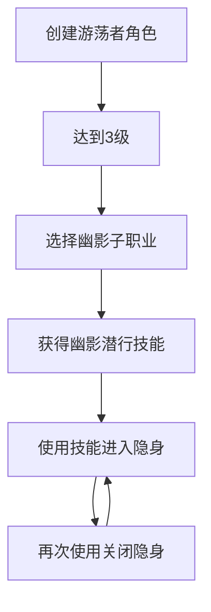

## 1. 产品概述

游荡者子职业"幽影(YouYing)"是一个专注于隐身和潜行的子职业，为玩家提供独特的永久隐身能力。

* 核心特色：在3级获得永久隐身的开关技能，可随时进入高级隐身状态进行战术操作。

* 目标用户：喜欢潜行、暗杀和战术性游戏风格的玩家。

## 2. 核心特性

### 2.1 用户角色

由于这是游戏内容模组，不涉及用户注册系统，所有玩家均可使用此子职业。

### 2.2 功能模块

幽影子职业需求包含以下核心页面和功能：

1. **子职业选择界面**：在游荡者职业选择时显示幽影选项
2. **技能获得界面**：3级时自动获得"幽影潜行"技能
3. **技能使用界面**：游戏内技能栏显示开关类隐身技能
4. **状态效果界面**：显示高级隐身状态和持续时间

### 2.3 页面详情

| 页面名称    | 模块名称    | 功能描述                                |
| ------- | ------- | ----------------------------------- |
| 子职业选择界面 | 幽影子职业显示 | 在游荡者3级子职业选择时显示"幽影"选项，包含子职业描述和特色技能说明 |
| 技能获得界面  | 幽影潜行技能  | 3级时自动获得"幽影潜行"技能，显示技能图标、名称和描述        |
| 技能使用界面  | 开关控制    | 在快捷栏显示"幽影潜行"技能，支持点击开启/关闭，显示当前状态     |
| 状态效果界面  | 高级隐身状态  | 技能激活时显示高级隐身图标，提供状态描述和剩余时间           |

## 3. 核心流程

**主要操作流程：**

1. 玩家创建游荡者角色
2. 达到3级时选择"幽影"子职业
3. 自动获得"幽影潜行"技能
4. 在战斗或探索中使用技能进入隐身
5. 再次使用技能可关闭隐身状态

## 4. 技能设计规范

### 4.1 幽影潜行技能详情

**技能名称：** 幽影潜行 (Shadow Stealth)

**技能类型：** 开关类主动技能

**获得等级：** 3级

**技能效果：**

* 开启时：立即进入高级隐身状态

* 关闭时：解除隐身状态

* 隐身期间：获得优势攻击骰，移动不会被发现

* 冷却时间：无（开关类技能）

* 消耗：每轮消耗1点法术位或特殊资源

**平衡性限制：**

* 攻击或施法会自动解除隐身

* 受到伤害时有概率被发现

* 在明亮光线下隐身效果减弱

* 每次战斗只能使用有限次数

### 4.2 技能进阶

**7级增强：** 隐身持续时间延长，移动速度提升

**10级增强：** 隐身时获得伤害抗性

**15级增强：** 可以在隐身状态下进行一次攻击而不解除隐身

**18级增强：** 隐身冷却时间减少，可以影响队友

## 5. 用户界面设计

### 5.1 设计风格

* **主色调：** 深紫色 (#2D1B69) 和银灰色 (#C0C0C0)

* **辅助色：** 暗蓝色 (#1E3A8A) 和淡紫色 (#E0E7FF)

* **按钮样式：** 圆角矩形，带有阴影效果

* **字体：** 游戏默认字体，技能名称使用加粗

* **图标风格：** 暗色调，带有阴影和神秘感的设计

* **动画效果：** 淡入淡出效果，隐身激活时有紫色光晕

### 5.2 页面设计概览

| 页面名称    | 模块名称   | UI元素                            |
| ------- | ------ | ------------------------------- |
| 子职业选择界面 | 幽影选项卡  | 深紫色背景，银色边框，幽影图标，子职业名称和描述文本      |
| 技能界面    | 幽影潜行技能 | 圆形技能图标，紫色边框，技能名称，开关状态指示器        |
| 快捷栏     | 技能按钮   | 小型技能图标，状态指示灯（绿色=可用，紫色=激活，灰色=冷却） |
| 状态栏     | 隐身效果   | 半透明紫色图标，剩余时间数字，状态描述工具提示         |

### 5.3 响应式设计

* 适配桌面端游戏界面

* 支持键盘快捷键操作

* 鼠标悬停显示详细信息

## 6. 本地化需求

### 6.1 多语言支持

* **中文：** 幽影、幽影潜行、高级隐身

* **英文：** YouYing、Shadow Stealth、Greater Invisibility

### 6.2 文本内容

**子职业描述：**

* 中文："掌握阴影力量的神秘游荡者，能够随意隐匿身形，如幽灵般无声无息。"

* 英文："Mysterious rogues who master shadow powers, able to conceal themselves at will like silent phantoms."

**技能描述：**

* 中文："融入阴影之中，获得高级隐身效果。再次使用可解除隐身。"

* 英文："Merge with shadows to gain greater invisibility. Use again to end the effect."

## 7. 技术实现要点

### 7.1 文件结构

* `ClassDescriptions.lsx`：定义幽影子职业

* `Progressions.lsx`：定义等级进展和技能获得

* `Passives.lsx`：定义被动效果

* `Spells.lsx`：定义幽影潜行技能

* `StatusData.lsx`：定义隐身状态效果

### 7.2 关键UUID

* 子职业UUID：需要生成唯一标识符

* 技能UUID：需要生成唯一标识符

* 状态效果UUID：需要生成唯一标识符

### 7.3 平衡性测试

* 确保技能不会过于强大影响游戏平衡

* 测试与其他职业和模组的兼容性

* 验证AI敌人对隐身的反应机制

